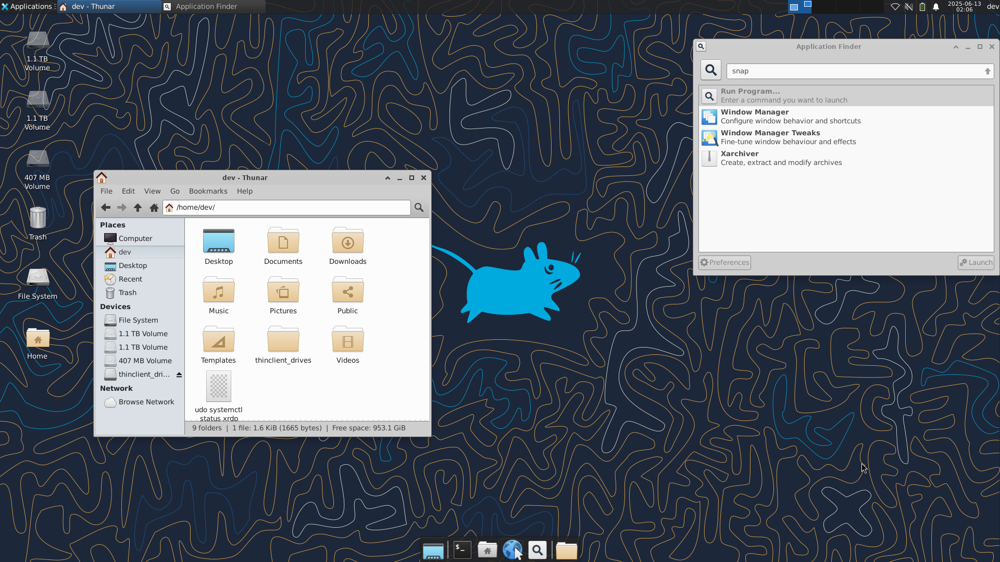

# Linux GUI Setup Guide

A detailed and secure step-by-step guide to enable a lightweight graphical desktop environment accessible remotely via XRDP on Ubuntu or Windows Subsystem for Linux 2 (WSL2). Perfect for users wanting a stable remote desktop experience.




## Prerequisites

- Running Linux server (Only For Windows `wsl --list --online` then `wsl --install -d <Distribution Name>`)
- Root or sudo privileges  
- Stable internet connection  

> **Note for WSL2 users:** Ensure WSL version 2 is enabled. Networking in WSL2 might require connecting via `localhost` with port forwarding or using your Windows host IP address.
## Step 1: Install Tools

```bash
sudo apt update &&
apt upgrade -y &&
apt install -y xrdp xfce4 xfce4-goodies &&
apt install -y net-tools ufw
```
#### What it does
- Updates package list
- Upgrades installed packages
- Installs `XRDP` and the `XFCE` desktop environment with extras
- installs `net-tools` (for commands like netstat) and `ufw` (firewall management)

## Step 2: Configure XRDP Server

### Backup the default XRDP configuration file

```bash
sudo cp /etc/xrdp/xrdp.ini /etc/xrdp/xrdp.ini.bak
```

### XRDP Port configuration
```bash
sudo sed -i 's/3389/3390/g' /etc/xrdp/xrdp.ini
```
### XRDP screen scaling and color
```bash
sudo sed -i 's/max_bpp=32/#max_bpp=32\nmax_bpp=128/g' /etc/xrdp/xrdp.ini &&
sed -i 's/xserverbpp=24/#xserverbpp=24\nxserverbpp=128/g' /etc/xrdp/xrdp.ini
```

## Step 3: Set XFCE as the Default Session

Set XFCE4 as the default desktop session for XRDP connections:

```bash
echo xfce4-session > ~/.xsession
```

## Step 4: Edit XRDP Startup Script

Edit the startup script to launch the XFCE desktop environment:

```bash
sudo nano /etc/xrdp/startwm.sh
```

Replace the content with the following:

```bash
#!/bin/sh
# xrdp X session start script (c) 2015, 2017, 2021 mirabilos
# published under The MirOS Licence

# Rely on /etc/pam.d/xrdp-sesman using pam_env to load both
# /etc/environment and /etc/default/locale to initialise the
# locale and the user environment properly.

if test -r /etc/profile; then
        . /etc/profile
fi

if test -r ~/.profile; then
        . ~/.profile
fi

#test -x /etc/X11/Xsession && exec /etc/X11/Xsession
#exec /bin/sh /etc/X11/Xsession
#xfce
startxfce4
```

Save and exit (`Ctrl + S` then `Ctrl + X`).

## Step 5: Verify Network & XRDP Service
### Enable XRDP service
```bash
sudo systemctl start xrdp &&
systemctl enable xrdp
```
### Check Firewall Rules 
```bash
sudo ufw allow 3389/tcp &&
sudo ufw allow ssh &&
sudo ufw reload
```
#### What it does
- Opens port 3389 for Remote Desktop (XRDP).
- Opens port 22 for SSH access.
- Reloads firewall rules to apply changes.

### Check Firewall Status
```bash
sudo ufw status
```
### If Firewall not enabled (optional) 
```bash
sudo ufw enable
```

### Check server’s IP address, XRDP listening ports & XRDP service status 
```bash
sudo netstat -tulpn | grep xrdp && hostname -I && systemctl status xrdp
```
Expected output includes a line with port `3390` in the `LISTEN` state.


## Step 6: Connect Using Remote Desktop

### For Windows
- Press (`Ctrl + R`) to open the Run dialog.
- Type (`mstsc.exe`).  
- Enter your Linux machine’s IP address followed by (for example, `localhost:3390` or `server ip address:3390`).
- Click Connect. 
- Log in using your **Linux username** and **password**.
### For Linux/macOS
- Use **Remmina**, **KRDC** or another RDP client.
- Enter your Linux machine’s IP address followed by (for example, `localhost:3390` or `server ip address:3390`).
- Connect and log in with your Linux credentials.

## Troubleshooting Tips

- If the session closes immediately after login, ensure your `~/.xsession` file contains only:  
  ```
  xfce4-session
  ```
- Restart XRDP after making changes:  
  ```bash
  sudo systemctl restart xrdp
  ```
- If remote connection fails, check firewall rules on both Linux and Windows.
- Keyboard layout and clipboard redirection may require additional configuration.

## References

- [XFCE Desktop Environment](https://xfce.org/)  
- [Ubuntu Official Documentation](https://help.ubuntu.com/)  
- [XRDP GitHub Repository](https://github.com/neutrinolabs/xrdp)  
- [Microsoft Remote Desktop Documentation](https://support.microsoft.com/en-us/windows/how-to-use-remote-desktop-5fe128d5-8fb1-7a23-3b8a-41e636865e8c)  
- [Windows Subsystem for Linux (WSL2)](https://learn.microsoft.com/en-us/windows/wsl/)

## License

This guide is published under The [MIT Licence](https://choosealicense.com/licenses/mit/).

## Contributions

Contributions, bug reports, and suggestions are welcome! Please open an issue or pull request on the [GitHub repository](https://github.com/sadbinsiddique/Linux-GUI-XRDP-XFCE-Setup).
