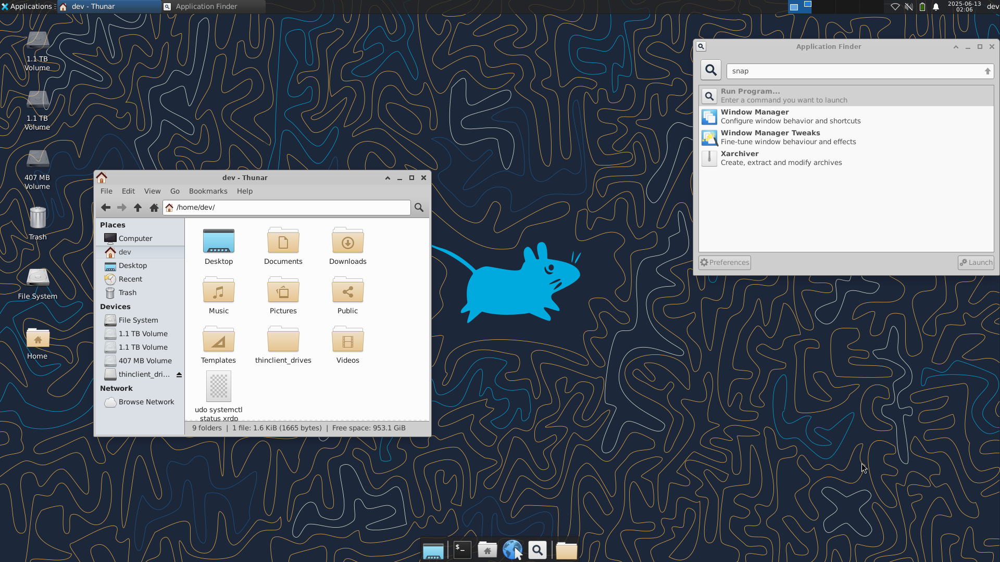

# Linux GUI Setup Guide

A detailed and secure step-by-step guide to enable a lightweight graphical desktop environment accessible remotely via XRDP on Ubuntu or Windows Subsystem for Linux 2 (WSL2). Perfect for users wanting a stable remote desktop experience.




## Prerequisites

- Running Linux server (Only For Windows `wsl --list --online` then `wsl --install -d <Distribution Name>`)
- Root or sudo privileges  
- Stable internet connection  

> **Note for WSL2 users:** Ensure WSL version 2 is enabled. Networking in WSL2 might require connecting via `localhost` with port forwarding or using your Windows host IP address.

## Table of Contents

- [Step 1: Install Tools](#step-1-install-tools)
- [Step 2: Configure XRDP Server](#step-2-configure-xrdp-server)
- [Step 3: Set XFCE as the Default Session](#step-3-set-xfce-as-the-default-session)
- [Step 4: Edit XRDP Startup Script](#step-4-edit-xrdp-startup-script)
- [Step 5: Verify Network & XRDP Service](#step-5-verify-network--xrdp-service)
- [Step 6: Connect Using Remote Desktop](#step-6-connect-using-remote-desktop)
- [Troubleshooting Tips](#troubleshooting-tips)
- [Security Best Practices](#security-best-practices)
- [References](#references)

## Step 1: Install Tools

```bash
sudo apt update && sudo apt upgrade -y && sudo apt install -y xrdp xfce4 xfce4-goodies net-tools ufw
```

### What it does

- Updates package list
- Upgrades installed packages
- Installs `XRDP` and the `XFCE` desktop environment with extras
- Installs `net-tools` (for commands like netstat) and `ufw` (firewall management)

## Step 2: Configure XRDP Server

### Backup the default XRDP configuration file

```bash
sudo cp /etc/xrdp/xrdp.ini /etc/xrdp/xrdp.ini.bak
```

### XRDP Port configuration

> **Why change the port?** Port 3389 is the default Windows Remote Desktop port. Changing to 3390 prevents conflicts when running both Windows RDP and XRDP, especially useful in WSL2 environments.

```bash
sudo sed -i 's/3389/3390/g' /etc/xrdp/xrdp.ini
```

### XRDP screen scaling and color

```bash
sudo sed -i -e 's/max_bpp=32/#max_bpp=32\nmax_bpp=128/g' -e 's/xserverbpp=24/#xserverbpp=24\nxserverbpp=128/g' /etc/xrdp/xrdp.ini
```

## Step 3: Set XFCE as the Default Session

Set XFCE4 as the default desktop session for XRDP connections:

```bash
echo xfce4-session > ~/.xsession
```

## Step 4: Edit XRDP Startup Script

Edit the startup script to launch the XFCE desktop environment:

```bash
sudo nano /etc/xrdp/startwm.sh
```

Replace the content with the following:

```bash
#!/bin/sh
# xrdp X session start script (c) 2015, 2017, 2021 mirabilos
# published under The MirOS Licence

# Rely on /etc/pam.d/xrdp-sesman using pam_env to load both
# /etc/environment and /etc/default/locale to initialise the
# locale and the user environment properly.

if test -r /etc/profile; then
        . /etc/profile
fi

if test -r ~/.profile; then
        . ~/.profile
fi

#test -x /etc/X11/Xsession && exec /etc/X11/Xsession
#exec /bin/sh /etc/X11/Xsession
#xfce
startxfce4
```

Save and exit (`Ctrl + O`, press `Enter` to confirm, then `Ctrl + X`).

## Step 5: Verify Network & XRDP Service

### Enable XRDP service

```bash
sudo systemctl start xrdp && sudo systemctl enable xrdp
```

#### Service details

- Starts the XRDP service immediately.
- Enables XRDP to start automatically on system boot.

### Check Firewall Rules

```bash
sudo ufw allow 3390/tcp && sudo ufw allow ssh && sudo ufw reload
```

#### Firewall rule summary

- Opens port 3390 for Remote Desktop (XRDP).
- Opens port 22 for SSH access.
- Reloads firewall rules to apply changes.

### Check Firewall Status

```bash
sudo ufw status
```

### If Firewall not enabled (optional)

```bash
sudo ufw enable
```

### Check server’s IP address, XRDP listening ports & XRDP service status

```bash
sudo netstat -tulpn | grep xrdp && hostname -I && sudo systemctl status xrdp
```

Expected output includes a line with port `3390` in the `LISTEN` state.

## Step 6: Connect Using Remote Desktop

### For Windows

- Press `Win + R` to open the Run dialog.
- Type `mstsc.exe`.  
- Enter your server address:
  - **WSL2 users (from Windows)**: Use `localhost:3390`
  - **Remote server**: Use `server_ip_address:3390` (e.g., `192.168.1.100:3390`)
- Click Connect.
- At the XRDP login screen:
  - **Session**: Select `Xorg`
  - **Username**: Your Linux username
  - **Password**: Your Linux password
- Click OK to start your session.

### For Linux/macOS

- Use **Remmina**, **KRDC** or another RDP client.
- Enter your Linux machine’s IP address followed by (for example, `localhost:3390` or `server ip address:3390`).
- Connect and log in with your Linux credentials.

## Troubleshooting Tips

- If the session closes immediately after login, ensure your `~/.xsession` file contains only:  

  ```bash
  xfce4-session
  ```

- Restart XRDP after making changes:  

  ```bash
  sudo systemctl restart xrdp
  ```

- **Multiple sessions**: If you're already logged in locally or via another RDP session, you may experience conflicts. Log out of other sessions first.

- **Black screen or frozen session**:

  ```bash
  # Check if XRDP is running
  sudo systemctl status xrdp
  # View XRDP logs for errors
  sudo tail -f /var/log/xrdp.log
  ```

- **Performance issues**: XFCE is lightweight (typically uses 200-400MB RAM), but consider:
  - Disabling compositor: Settings → Window Manager Tweaks → Compositor → Uncheck "Enable display compositing"
  - Reducing visual effects

- If remote connection fails, check firewall rules on both Linux and Windows.
- Keyboard layout and clipboard redirection may require additional configuration.

## Security Best Practices

### SSH Security

- **Use key-based authentication** instead of passwords:

  ```bash
  ssh-keygen -t ed25519 -C "your_email@example.com"
  ```

- **Change default SSH port** (optional but recommended):

  ```bash
  sudo nano /etc/ssh/sshd_config
  # Change Port 22 to another port (e.g., 2222)
  sudo systemctl restart ssh
  ```

### XRDP Security

- **Use strong passwords** for all user accounts
- **Consider VPN** for remote access instead of exposing XRDP directly to the internet
- **Limit login attempts** using fail2ban:

  ```bash
  sudo apt install fail2ban
  sudo systemctl enable fail2ban
  ```

### Network Security

- Only open necessary ports in your firewall
- If possible, restrict access to specific IP addresses:

  ```bash
  sudo ufw allow from 192.168.1.0/24 to any port 3390
  ```

## References

- [XFCE Desktop Environment](https://xfce.org/)  
- [Ubuntu Official Documentation](https://help.ubuntu.com/)  
- [XRDP GitHub Repository](https://github.com/neutrinolabs/xrdp)  
- [Microsoft Remote Desktop Documentation](https://support.microsoft.com/en-us/windows/how-to-use-remote-desktop-5fe128d5-8fb1-7a23-3b8a-41e636865e8c)  
- [Windows Subsystem for Linux (WSL2)](https://learn.microsoft.com/en-us/windows/wsl/)

## License

This work is licensed under [CC BY 4.0](https://creativecommons.org/licenses/by/4.0/).

 
